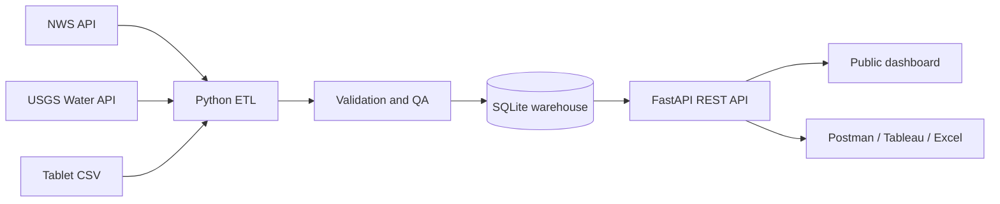

# Montana Public Data Lab

A hands-on sandbox for learning APIs, ETL pipelines, SQL, data quality,
weighted metrics, and public-facing dashboards.

The project models a small tourism and recreation data system:

- **Live NWS data** supplies forecasts and active Montana weather alerts.
- **Live USGS data** supplies near-real-time streamflow observations.
- **Synthetic tablet data** supplies park visitation counts, including a few
  intentional defects for quality-assurance practice.
- **SQLite** acts as a compact analytical warehouse.
- **FastAPI** exposes documented REST and CSV endpoints.
- **Chart.js and Leaflet** power a public-style browser dashboard.

The architecture and exercises were chosen to match the skills in
`Job Description.txt`: Python, SQL, API testing, ETL, QA, weighted analysis,
interactive visualization, and communicating results to nontechnical users.

## Quick Start

You need Python 3.11 or newer. This repository is configured for
[uv](https://docs.astral.sh/uv/), which installs the environment and creates a
lockfile:

```powershell
uv sync --dev
uv run python -m montana_data_lab refresh
uv run python -m montana_data_lab serve
```

Then open:

- Dashboard: http://127.0.0.1:8000
- Interactive API documentation: http://127.0.0.1:8000/docs
- Health endpoint: http://127.0.0.1:8000/api/health

The `refresh` command creates the database, generates six months of reproducible
sample visitation data, fetches live public data, and runs QA checks. If a
public service is temporarily unavailable, the other pipeline stages still
finish and the failure is recorded in `pipeline_runs`.

## Useful Commands

```powershell
# Create tables and reference records
uv run python -m montana_data_lab init

# Generate a new raw tablet CSV with a different random seed
uv run python -m montana_data_lab generate-sample --seed 99 --days 365

# Load only the local visitation CSV
uv run python -m montana_data_lab load-visits

# Fetch NWS and USGS data
uv run python -m montana_data_lab fetch-live

# Re-run data-quality rules
uv run python -m montana_data_lab qa

# Run the whole pipeline
uv run python -m montana_data_lab refresh

# Schedule a refresh every 60 minutes
uv run python -m montana_data_lab schedule --minutes 60

# Start the API and dashboard
uv run python -m montana_data_lab serve --reload

# Run automated tests and linting
uv run pytest
uv run ruff check .
```

## Architecture



The code is deliberately separated into layers:

| Layer | Location | What to learn |
|---|---|---|
| Configuration | `src/montana_data_lab/config.py` | Environment variables and portable paths |
| Database models | `src/montana_data_lab/models.py` | Tables, keys, indexes, lineage |
| API clients | `src/montana_data_lab/clients/` | HTTP, headers, timeouts, retries, parsing |
| ETL jobs | `src/montana_data_lab/pipeline/` | Extract, transform, load, idempotency |
| QA rules | `src/montana_data_lab/pipeline/quality.py` | Validation, audit records, defect handling |
| REST API | `src/montana_data_lab/api.py` | Endpoints, query parameters, OpenAPI |
| Dashboard | `src/montana_data_lab/web/` | Fetching APIs and interactive visualization |
| SQL practice | `sql/learning_queries.sql` | Analytical queries used by BI tools |
| Tests | `tests/` | Contract tests and transformation tests |

## Guided Learning Path

Work through these in order. Each exercise changes a real part of the system.
Detailed prompts and hints are in [`docs/LEARNING_GUIDE.md`](docs/LEARNING_GUIDE.md).

1. Inspect an API response in the FastAPI docs and with PowerShell.
2. Trace one weather record from HTTP response to database to dashboard.
3. Add a park and observe how reference data drives the whole pipeline.
4. Change a QA threshold and explain the effect on public metrics.
5. Write SQL for monthly visitation and export the result.
6. Add a query parameter to an endpoint.
7. Add retry/backoff behavior and test a simulated upstream failure.
8. Build a new dashboard chart.
9. Connect Tableau, Power BI, or Excel to the CSV export.
10. Replace a synthetic source with another real public API.

## API Examples

```powershell
# Filtered JSON
Invoke-RestMethod "http://127.0.0.1:8000/api/visitation?days=30&metric=weighted"

# Latest streamflow
Invoke-RestMethod "http://127.0.0.1:8000/api/streamflow/latest"

# Download data suitable for Tableau or Excel
Invoke-WebRequest `
  "http://127.0.0.1:8000/api/export/visitation.csv?days=90" `
  -OutFile visitation.csv

# Trigger an on-demand refresh (a POST request)
Invoke-RestMethod `
  -Method Post `
  "http://127.0.0.1:8000/api/admin/refresh"
```

## Data Quality Behavior

The generated tablet file intentionally contains examples of:

- a negative count;
- a missing device identifier;
- a duplicate park/date/device record;
- an implausibly large outlier;
- an invalid survey weight.

The raw records remain in the warehouse for auditability. QA rules set
`quality_status` to `valid` or `invalid`, and public metrics use only valid
rows. This is a common production pattern: preserve source truth, then clearly
control which records are publishable.

## Configuration

Copy `.env.example` to `.env` if you want to change defaults. All sources used
here are public and require no API key. The NWS requests include the required
identifying `User-Agent`.

Important settings:

| Variable | Default |
|---|---|
| `MTDL_DATABASE_URL` | `sqlite:///data/montana_data_lab.db` |
| `MTDL_HTTP_TIMEOUT_SECONDS` | `20` |
| `MTDL_NWS_USER_AGENT` | Learning-project identifier |
| `MTDL_VISIT_OUTLIER_THRESHOLD` | `10000` |
| `MTDL_HOST` | `127.0.0.1` |
| `MTDL_PORT` | `8000` |

## Source Notes

- NWS API documentation: https://www.weather.gov/documentation/services-web-api
- USGS Water Services documentation: https://waterservices.usgs.gov/docs/

Both services can experience delays or temporary outages. The pipeline records
start time, finish time, row counts, status, and error messages so operational
failures can be distinguished from bad source data.

## Project Status

This is a learning template, not an official tourism product. Synthetic
visitation records must never be represented as observed public statistics.
